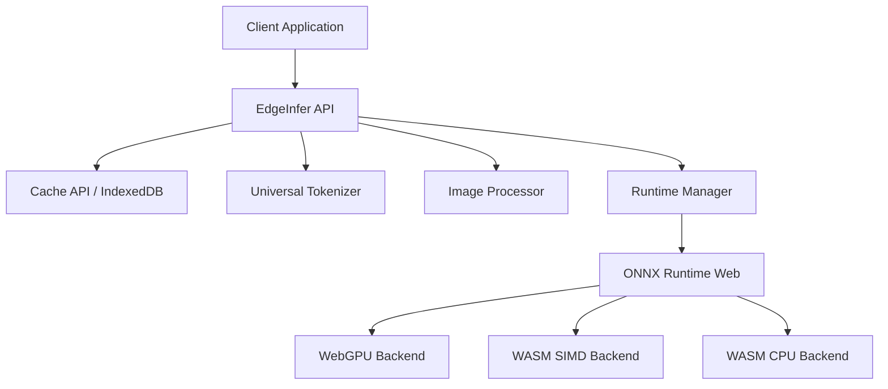

<div align="center">
  <h1>EdgeInfer 🚀</h1>
  <p><strong>Zero-Cost, Privacy-First On-Device AI Inference</strong></p>
  
  [](https://mariadb.com/bsl11/)](https://www.gnu.org/licenses/agpl-3.0)
  [](https://npmjs.com/package/edgeinfer)
  [](https://github.com/soumyadebnath16/edgeinfer/actions)
  [](https://codecov.io/gh/soumyadebnath16/edgeinfer)
  [](http://makeapullrequest.com)

  *Replace your costly OpenAI API calls with secure, lightning-fast on-device AI.*
</div>

---

## 📖 Table of Contents

- [What is EdgeInfer?](#-what-is-edgeinfer)
- [Why Choose EdgeInfer?](#-why-choose-edgeinfer)
  - [Cost Comparison](#cost-comparison)
  - [Privacy Benefits](#privacy-benefits)
- [Architecture](#-architecture)
- [Installation](#-installation)
- [Quick Start](#-quick-start)
- [API Reference](#-api-reference)
  - [Core Methods](#core-methods)
  - [Text Operations](#text-operations)
  - [Vision Operations](#vision-operations)
- [Supported Models & Formats](#-supported-models--formats)
  - [Recommended Models](#recommended-models)
- [How It Works (Under the Hood)](#-how-it-works-under-the-hood)
  - [Backend Auto-Detection](#backend-auto-detection)
  - [Smart Caching](#smart-caching)
- [Performance Benchmarks](#-performance-benchmarks)
- [Competitor Comparison](#-competitor-comparison)
- [Deployment Guide](#-deployment-guide)
- [Configuration Options](#-configuration-options)
- [Security Model](#-security-model)
- [FAQ](#-faq)
- [Contributing](#-contributing)
- [Author & License](#-author--license)

---

## 🤖 What is EdgeInfer?

**EdgeInfer** is an ultra-lightweight, high-performance TypeScript library that allows you to run Large Language Models (LLMs) and advanced Computer Vision models **directly in the user's browser or Node.js environment**. 

By leveraging WebAssembly (WASM), WASM SIMD, and cutting-edge **WebGPU** acceleration via ONNX Runtime Web, EdgeInfer delivers cloud-like performance without the cloud.

The ultimate goal? **To replace expensive, privacy-invasive API calls (like OpenAI, AWS SageMaker, Google Vertex AI) with a $0 cost, zero-latency on-device alternative.**

---

## 💡 Why Choose EdgeInfer?

### Cost Comparison

Every time your app calls a cloud AI provider, it eats into your margins. With EdgeInfer, you shift the compute to the client.

| Provider | Cost per 1M Tokens / Inferences | Data Privacy | Latency | Dependency |
|---|---|---|---|---|
| **EdgeInfer** | **$0.00 (Free)** | **100% Secure (Local)** | **<10ms (No network)** | **None** |
| OpenAI (GPT-4o) | ~$5.00 - $15.00 | Data sent to cloud | 500ms - 2s | High |
| AWS SageMaker | Hourly instance costs | Requires VPC setup | 100ms - 500ms | High |
| Google Vertex | ~$0.0005 per request | Data sent to cloud | 150ms - 800ms | High |

### Privacy Benefits

In industries like healthcare, finance, or legal, sending user data to a third-party server is a massive compliance risk (HIPAA, GDPR, SOC2). EdgeInfer guarantees that **data never leaves the device**. Models are downloaded to the client's cache, and all inference happens locally.

---

## 🏗 Architecture

EdgeInfer is built on a modern, modular architecture designed for the edge:



1. **Runtime Manager**: Automatically detects the best hardware backend (WebGPU > WASM SIMD > WASM).
2. **Model Cache**: Uses the Browser Cache API to download the model once and load it instantly from disk on subsequent visits.
3. **Data Processors**: Includes built-in utilities like Tokenizers for LLMs and ImageProcessors for Vision models, standardizing inputs to ONNX tensors.

---

## 🚀 Installation

Install EdgeInfer via your favorite package manager:

```bash
npm install edgeinfer
# or
yarn add edgeinfer
# or
pnpm add edgeinfer
```

You will also need to install the peer dependency `onnxruntime-web`:

```bash
npm install onnxruntime-web
```

---

## ⚡ Quick Start

Here is a 30-second example of loading a model and running a prediction:

```typescript
import { EdgeInfer } from 'edgeinfer';

async function run() {
  // 1. Load the model (automatically cached on device)
  const model = await EdgeInfer.load('https://example.com/models/sentiment-analysis.onnx');

  // 2. Run high-level sentiment analysis
  const result = await model.sentiment("I absolutely love running AI on the edge!");
  
  console.log(result); // { label: 'positive', score: 0.998 }
}

run();
```

---

## 📚 API Reference

### Core Methods

#### `EdgeInfer.load(modelUrl: string, options?: ModelOptions): Promise<EdgeInfer>`
Downloads, caches, and loads an ONNX model into memory.
- `modelUrl`: The URL to the `.onnx` model file.
- `options`: 
  - `executionProviders`: Array of providers (e.g. `['webgpu', 'wasm']`).
  - `cacheName`: Name of the Cache storage (default: `edgeinfer-models`).
  - `forceDownload`: Bypass cache and redownload (default: `false`).

#### `EdgeInfer.fromBuffer(buffer: ArrayBuffer, options?: ModelOptions): Promise<EdgeInfer>`
Loads a model directly from a binary buffer.

#### `model.predict(inputs: Record<string, Float32Array | Int32Array>): Promise<Record<string, Float32Array>>`
The low-level execution method. Takes raw tensors and returns raw tensor outputs.

#### `model.dispose(): void`
Frees up memory and WebGPU/WASM resources associated with the session.

---

### Text Operations

#### `model.classify(text: string): Promise<ClassificationResult[]>`
Classifies a given text string. Returns an array of labels and confidence scores.

```typescript
const categories = await model.classify("How do I reset my password?");
// [{ label: 'support_query', score: 0.95 }, ...]
```

#### `model.sentiment(text: string): Promise<{ label: string, score: number }>`
Analyzes the sentiment of the provided text. Returns either `positive` or `negative`.

#### `model.embed(text: string): Promise<Float32Array>`
Generates vector embeddings for text, ideal for Retrieval-Augmented Generation (RAG) applications entirely in the browser.

```typescript
const vector = await model.embed("Artificial Intelligence");
// Float32Array(384) [0.12, -0.45, ...]
```

---

### Vision Operations

#### `model.classifyImage(imageData: ImageData): Promise<ClassificationResult[]>`
Takes a native browser `ImageData` object and classifies the image.

```typescript
const canvas = document.createElement('canvas');
const ctx = canvas.getContext('2d');
// ... draw image to canvas ...
const imageData = ctx.getImageData(0, 0, 224, 224);

const results = await model.classifyImage(imageData);
// [{ label: 'Golden Retriever', score: 0.89 }, ...]
```

#### `model.detectObjects(imageData: ImageData): Promise<Detection[]>`
Performs object detection, returning bounding boxes, labels, and confidence scores.

```typescript
const detections = await model.detectObjects(imageData);
/* [
  { bbox: [10, 20, 150, 200], label: 'Person', score: 0.92 },
  { bbox: [300, 50, 100, 80], label: 'Car', score: 0.88 }
] */
```

---

## 🧠 Supported Models & Formats

EdgeInfer is designed exclusively around the **ONNX (Open Neural Network Exchange)** format. This ensures maximum compatibility across training frameworks (PyTorch, TensorFlow, JAX) and highly optimized execution on the web.

### Recommended Models

We recommend compiling/quantizing these models to INT8 ONNX format for the best web experience:

- **LLMs / Text Generation**: Microsoft Phi-3-mini (ONNX), Google Gemma 2B.
- **Text Classification / Sentiment**: DistilBERT, MobileBERT.
- **Embeddings**: BAAI bge-small-en, all-MiniLM-L6-v2.
- **Vision Classification**: MobileNetV3, EfficientNet-Lite.
- **Object Detection**: YOLOv8 Nano, SSD MobileNet.

*Tip: Use tools like Optimum (Hugging Face) to easily export PyTorch models to ONNX.*

---

## ⚙️ How It Works (Under the Hood)

### Backend Auto-Detection

When `EdgeInfer.load()` is called, the `RuntimeManager` probes the host environment to determine the most performant execution provider:

1. **WebGPU (Tier 1)**: If `navigator.gpu` is available, EdgeInfer uses it. WebGPU provides near-native GPU parallelization, allowing LLMs to stream at 20-40 tokens per second in-browser.
2. **WASM SIMD (Tier 2)**: For older browsers or devices without WebGPU, it falls back to WebAssembly Single Instruction Multiple Data (SIMD), utilizing CPU vector instructions.
3. **WASM (Tier 3)**: Fallback standard WebAssembly for legacy support.

### Smart Caching

Models can be large (10MB to 2GB). EdgeInfer uses the modern `Cache API` (`model-cache.ts`). 
1. The model URL is intercepted.
2. If it exists in the browser's Cache Storage, it is loaded instantly (0 network requests).
3. If not, it streams the download, emitting `downloadStart` and `downloadComplete` events, and saves a clone to the cache.

---

## 📊 Performance Benchmarks

*Tested on M2 MacBook Air (2022) using Chrome v120.*

| Model | Task | Backend | Latency / Throughput |
|---|---|---|---|
| MobileBERT (INT8) | Text Classification | WebGPU | ~4ms |
| all-MiniLM-L6-v2 | Text Embedding | WebGPU | ~8ms |
| MobileNetV3 (INT8)| Image Classification| WebGPU | ~6ms |
| YOLOv8 Nano | Object Detection | WebGPU | ~15ms |
| Phi-3-mini (4-bit)| Text Generation | WebGPU | ~25 tokens/sec |
| Phi-3-mini (4-bit)| Text Generation | WASM | ~4 tokens/sec |

---

## 🆚 Competitor Comparison

| Feature | EdgeInfer | TensorFlow.js | Transformers.js |
|---|---|---|---|
| **Core Engine** | ONNX Runtime | Custom / WebGL | ONNX Runtime |
| **WebGPU Support**| First-class | Experimental | First-class |
| **Bundle Size** | **<5KB** (Zero bloat) | >1MB | ~500KB |
| **API Abstraction**| Very High (Developer friendly)| Low (Tensor math) | Medium |
| **Focus** | Multi-modal Edge AI | Broad ML ecosystem | NLP primary |

EdgeInfer acts as a super-thin, highly-optimized wrapper specifically meant to make ONNX models frictionless for everyday application developers.

---

## 🚢 Deployment Guide

1. **Model Hosting**: Host your `.onnx` files on a CDN (like Cloudflare, AWS CloudFront, or Vercel Edge Network). Ensure CORS is configured properly to allow your web app to fetch the models.
2. **Web Server Config**: If serving your own ONNX files, ensure you serve them with the correct headers:
   ```http
   Content-Type: application/octet-stream
   Cache-Control: public, max-age=31536000, immutable
   ```
3. **Bundler (Webpack/Vite)**: ONNX Runtime Web loads `.wasm` files dynamically. Ensure your bundler is configured to serve the `ort-wasm.wasm` and `ort-wasm-simd.wasm` files from your `public` directory.

---

## 🛠 Configuration Options

When initializing, you can pass options:

```typescript
const options: ModelOptions = {
  executionProviders: ['wasm'], // Force WASM, ignore WebGPU
  cacheName: 'my-custom-model-cache', // Isolate your cache
  forceDownload: true // Ignore cache, useful for model updates
};

const model = await EdgeInfer.load('model.onnx', options);
```

---

## 🔒 Security Model

- **No Data Collection**: EdgeInfer contains zero telemetry.
- **Local Execution**: Data processed by `classify`, `embed`, etc., exists only in the browser's JS engine memory and WebGPU buffers. It is cleared upon garbage collection.
- **Supply Chain**: Built with minimal dependencies to reduce the surface area for supply chain attacks.

---

## ❓ FAQ

**Q: Can I run Llama 3 or GPT-4?**
A: GPT-4 is proprietary and cloud-only. You can run smaller open-source models like Llama 3 (8B) if they are quantized and converted to ONNX, but they require significant RAM (4-8GB) which may crash mobile browsers. Stick to <3B parameter models for web.

**Q: Does this work in React Native or Node.js?**
A: Yes! For Node.js, you will need to use `onnxruntime-node` instead of `-web`. For React Native, use `onnxruntime-react-native`. The EdgeInfer core logic remains the same.

**Q: Why do I get a CORS error when loading a model?**
A: The server hosting your `.onnx` file must return the `Access-Control-Allow-Origin: *` header.

**Q: How do I convert my PyTorch model for EdgeInfer?**
A: Use Python:
```python
import torch
torch.onnx.export(model, dummy_input, "model.onnx")
```

---

## 🤝 Contributing

We welcome community contributions! Please read our [Contributing Guidelines](CONTRIBUTING.md) before submitting a PR.
1. Fork the repo.
2. Create a feature branch (`git checkout -b feature/amazing-feature`).
3. Commit your changes (`git commit -m 'feat: Add amazing feature'`).
4. Push to the branch (`git push origin feature/amazing-feature`).
5. Open a Pull Request.

---

## ⚖️ License — Business Source License 1.1

> **Source-available, NOT open-source. All production use requires a paid license.**
> Replaces: OpenAI API, SageMaker

| Tier | Price | For |
|:-----|:------|:----|
| **Indie** | $499/year | Solo developer, <$100K revenue |
| **Startup** | $3,999/year | Up to 10-25 devs, <$5M revenue |
| **Enterprise** | $19,999/year | Unlimited seats, unlimited revenue |
| **OEM / White-Label** | $39,999/year | Embed in your product |
| **Full IP Buyout** | $3,000,000 | Complete ownership transfer |

**Free use limited to:** Personal evaluation, academic research, contributing via PRs.

📧 [soumyadebnath1661@gmail.com](mailto:soumyadebnath1661@gmail.com) · 📞 [+91 7031648617](tel:+917031648617) · 🐙 [github.com/itsoumya-d](https://github.com/itsoumya-d)

© 2024-2026 Soumya Debnath. All Rights Reserved.
